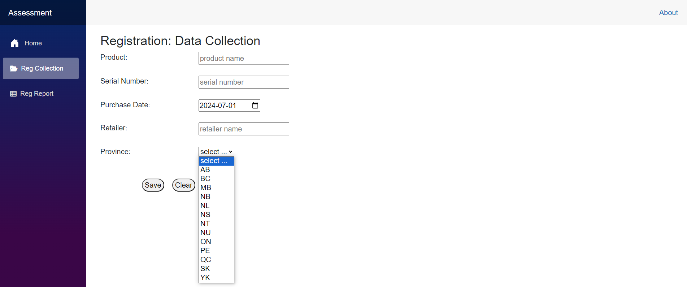
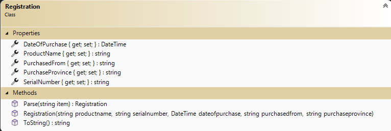
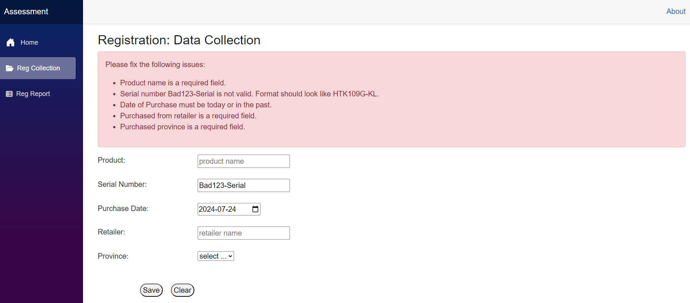
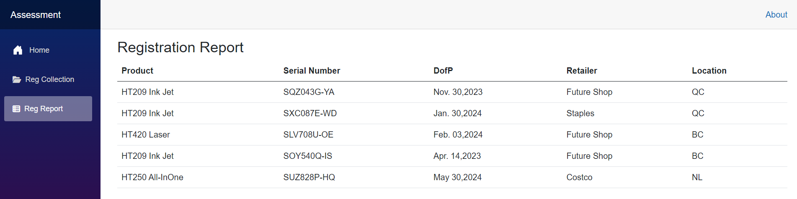
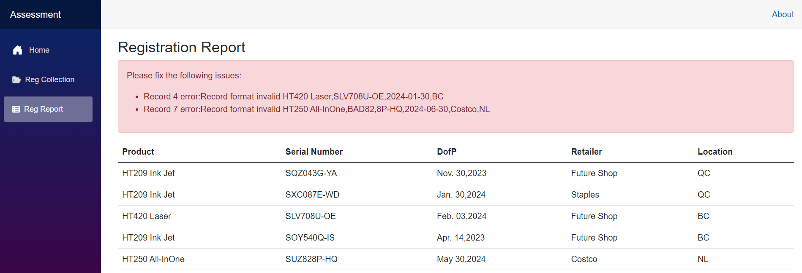

# In Class Assessment 2 - Blazor Pages and File Storage

## Multiple Choice (Weight 4%) /  Coding Problem (Weight 11%)

## Coding Problem

## Overview

Your task is to complete several coding components for managing a list of product registrations. The evaluation rubric is at the end of this document.

A [.NET Solution file](src/AssessmentSolution.sln) with a web application project has already been provided to you and can be found in the **`src`** folder. Use this solution when providing your answers for this assessment. Do **not** create your own solutions or projects for this assessment. This application has working code that **does not** need to be altered. **Add** the requested activity code to the work supplied.

In this assessment, you are required to demonstrate your ability to:

- Blazor component form creation: fields and buttons
- Ensure proper functionality of your button event methods including validation and error handling
- Blazor tabular report display
- File IO to/from a csv file

### Use Frequent Commits

Commit your work at the end of each and every **Activity**. ***Mark(s) may be deducted based on the commit activity in your repository.*** Ensure you sync your local clone to GitHub before the end of class. The classroom assessment ends at the end of class period. **It is your responsibility to ensure your work is properly submitted. Failure to submit your work may result in deductions up to and including a final mark of 0 (zero) for this assessment.**

----

## Activity 1: Assessment Home

Add your name to the `Home.razor` as an `h4` header line.

----

## Activity 2: Registration Form

> The `Registration.cs` file has been created for you defining the data class. **Do Not modify this class.**

Complete the **`RegistrationCollection.razor`** component by providing a form to gather data for each class property according to the [class diagram](#class-diagram). Feedback and Error message controls have been supplied.
Set your Date of Purchase to today's date in the `OnInitialized()` method.

- Product Name, Serial Number, Date Of Purchase and Purchase From controls will be input controls
- Purchase Province will be a select control. You may hard code the options (AB,BC,MB,NB,NL,NS,NT,NU,ON,PE,QC,SK,YK).
- Use supplied image as a guide for your form (does not need to be exact copy)
- Create appropriate component C# fields to bind to form controls
- Create buttons and bind to the supplied button event methods

### Class Diagram

----

## Activity 3: Registration Button Event OnClear Method

This event will empty the form controls, clear feedback and messages.

----

## Activity 4: Registration Button Event OnSave Method

This event will validate the data entered within the form, create a comma spearate string of the values, and append the string to a text file (.csv). Use the filename `RegistrationGood.csv` located in the supplied `Data` folder. Validation messages must be unique. Include appropriate user friendly error handling to manage system errors.

- Validation:
  - All fields are required
  - Date of Purchase must be today or in the past
  - Serial Number must be of the pattern XXX999X-XX ("[A-Z][A-Z][A-Z][0-9][0-9][0-9][A-Z]-[A-Z][A-Z]")
 
 

----

## Activity 5: Registration Tabular Report

The `RegistrationReport.razor` component will read the registration data file and display the data in a tabular report, image below. This report will be presented as the page appears upon opening. Create a unique appropriate feedback message stating if the file is not present or contains no records.

#### Report with no errors

#### Report with errors

----

> **Remember:** When you are finished, make sure you have pushed your code to GitHub.
 
|  Weight  |              Deliverable             |
| :------: |  :---------------------------------: |
|    3     |        Data Collection form         |
|    3    |  Data Collection - Save (validation) |
|    1     |        Data Collection - Clear       |
|    2     |     Report - Tabular display       |
|    2     |       Report - File IO (Read)       |
|   ----   |              ----------              |
|    11    |                 Total                |
