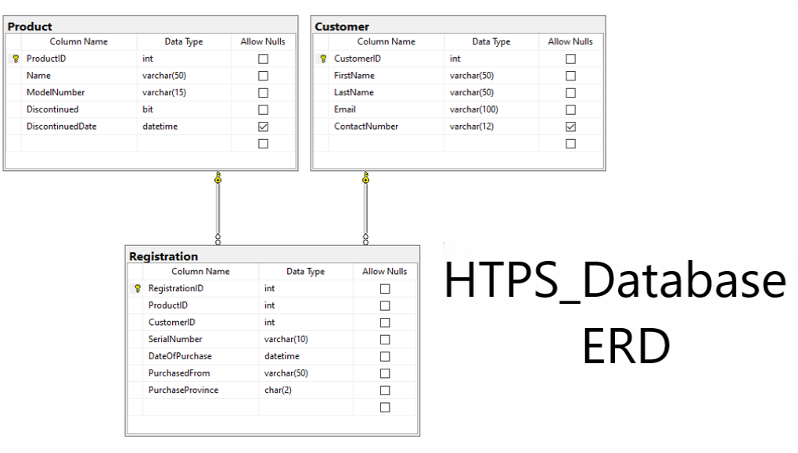
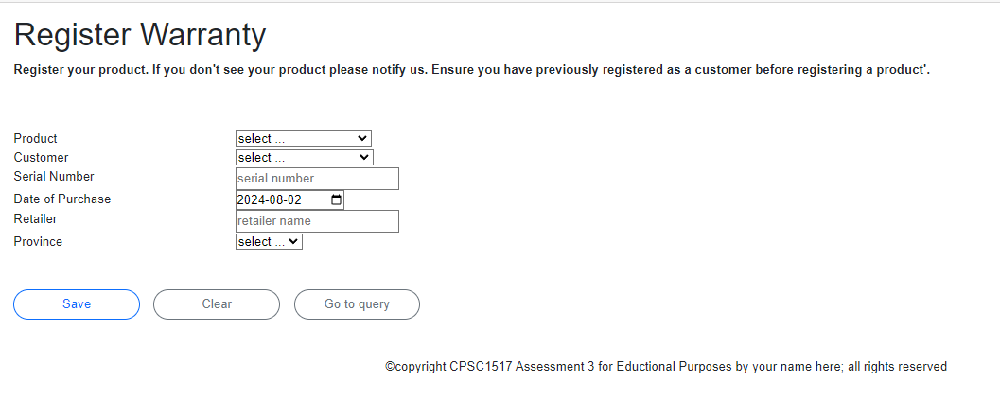
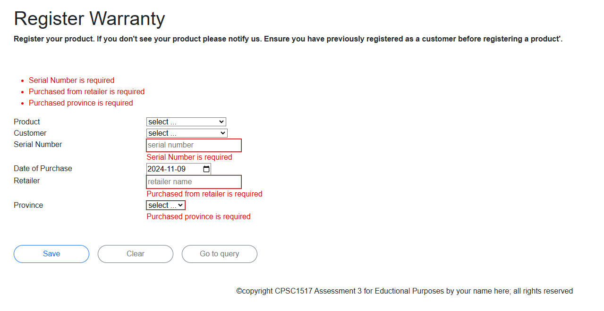
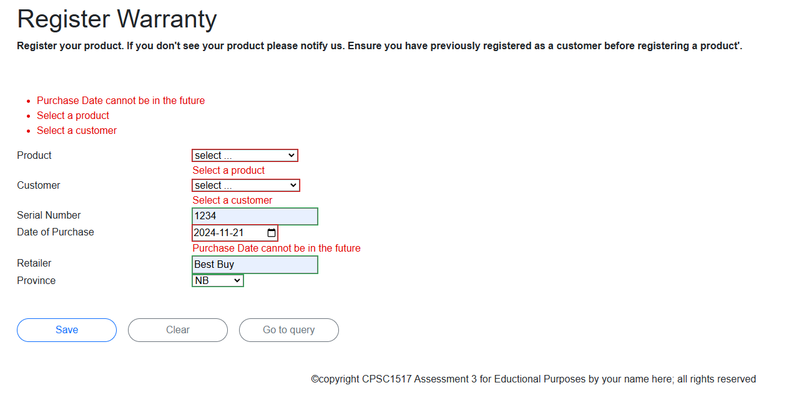
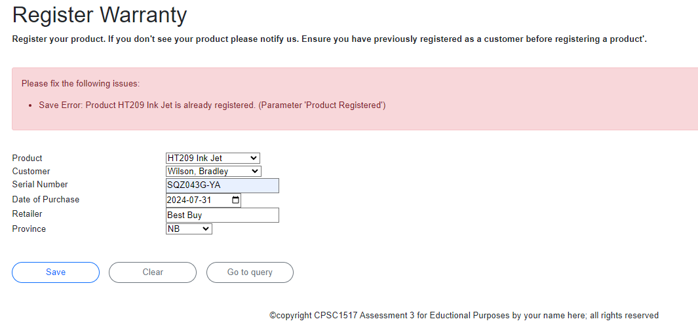
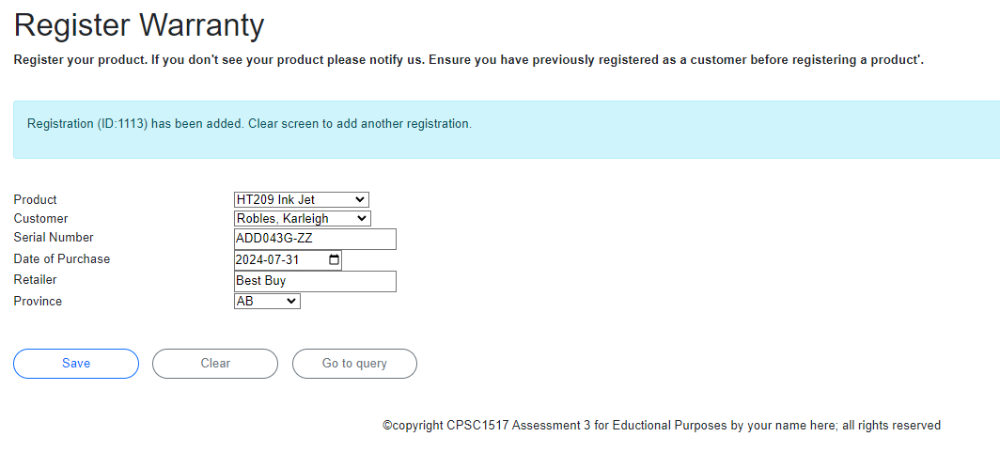

### In-Class Assessment 3 Blazor Pages - HTTP - 

## Multiple Choice (Weight 4%)  Coding Problem (Weight 11%)

> Using Blazor Pages for Data CRUD
> 
> **Read the entire instructions before beginning your work**

----

## Database

The physical database can be installed from the `.bacpac` file included in the starter kit.

## About HTPS

> **HTPS** is a privately owned product registration service use for warranties.

## Requirements

In this assessment, you will be demonstrating your understanding of:

- Code a service method containing validation and using EntityFramework to alter a database
- Code an EditForm form on a Blazor Page, purpose, data entry using client side validation
- Implementing events for form buttons.
- Implementation validation code within an event post method

You have been supplied a starting solution for this assessment. **Your answer MUST be coded in the supplied solution.** It contains a database and a **Visual Studio .Net Core 8 solution** with certain portions of the assessment pre-coded. **The supplied code compiles and should not be altered *except* to uncomment code.** Only *modify/extend* the portions identified in these assessment instructions.

### Use Frequent Commits

Commit your work at the end of each and every **Activity**. Mark(s) may be deducted based on the commit activity in your repository. Ensure you sync your local clone to GitHub before the end of class. The classroom assessment ends at the end of class period. **It is your responsibility to ensure your work is properly submitted. Failure to submit your work may result in deductions up to and including a mark of 0 (zero) for this assessment.**

### Setup

Restore the supplied SQL database `.bacpac` file. The database name is **HTPS_Database**. The database contains data for testing your solution.

## HTPS ERD

Modify the connection string in `appsetting.json` file so it points to your database server. Your Blazor page will not execute unless you properly complete this configuration.

Run the solution in the starter kit. It should run without compiler errors and you should be able to open the incomplete assessment form page `RegisterationCRUD.razor` and a query page listing the current product registrations on file, `Registrations.razor`. The Add New Registration button on the query page can be use to get to the CRUD page.

On the `_MainLayout.razor` page, place your name on the footer replacing **your name here**.

### Using the TODO task list

Work to be done can be seen in the TODO task list. TODO numbers relate to your assessment Activity. Any TODO ***without a number can be ignored***.

----
### Activity 1 - CRUD Services: `RegistrationServices.cs`

The `AddRegistration` service method will verify a) a Registraton parameter instance was passed (`ArgumentNullException`); and b) a record with the same product ID and serial number does not already exist on the registration table (`ArgumentException`). If any vertification fails, throw an appropriate exception as indicated. If the data is acceptable, add the registraton to the database. Return the new RegistrationID.

### Activity 2 - Code the EditForm fields needed to collect Registration data: `RegistrationCRUD.razor`

Add the necessary EditForm controls to collect registration data. Obtaining the productid will be done using a dropdown list, the text display will be the product name. Obtaining the customerid will be done using a dropdown list, the text display will be the customer full name. **Your Customer entity has a readonly property for the full name. Assume that the customer has registered earlier with HTTP and will exist on the customer table.** The dropdown lists must have a prompt line.  Use `text` controls for strings; and a `date` control for date for appropriate input controls.

**The Registration entity model has already been setup with appropriate validation annotation and custom messages. No changes to the entity needs to be done.**

Properties have been created in the `RegistrationCRUD.razor` which can be used to setup the Editform data collection controls. Use the following image to help setup your EditForm controls. You do **not** need to actually match the image but **must** use the requrested types of controls.

 

### Activity 3 - Code the event handler for the post events Clear and Query: `RegistrationCRUD.razor`

The Clear (`Clear button`) event handler will empty the registration record and refresh your page. The Query (`Return to Registrations button`) event handler will return the user to the registrations query page. Obtain confirmation from the user to do the actions. Your message should include the notion of lost data.

### Activity 4 - Code the event handler for the post event Add: `RegistrationCRUD.razor`

The Add (`Save button`) event handler will clear all old messages and check if the validate state is valid. If valid, further validation will be done. Verify a product and customer was selected, and check that the purchase date is less than or today (not a date in the future). If any validation fails, set an appropriate error message for the problem using the validation message control. If these vertifications are good, pass the registration information to the Registration services for processing. If the processing is successful, display an appropriate message. Processing must be done with user friendly error handling. Appropriate fields have been supplied for your feedback and error messages.

### Hint:

**Dates can be compared using relative operators.**

Add any necessary variables to complete your work.

## Various Form States
### (error message styling, weight and color, is **optional**)

Client Side Model Validation

 

Client Side Custom Event Validation

 

Service Method Validation

   

Successful Registration Add

 

 | Weight | Deliverable | 
| :----: | ---------- |
| 3 | Code a data collection form on a Blazor Page as outlined in specifications  |
| 3 | Implementation: button event for Save maintenace action including user friendly error handling   |
| 1 | Implementation: button event for Clear action with confirmation prompt |
| 1 | Implementation: button event for Query action with confirmation prompt |
| 2 | Code a service method : using EntityFramework to alter a database |
| 10 | Total |